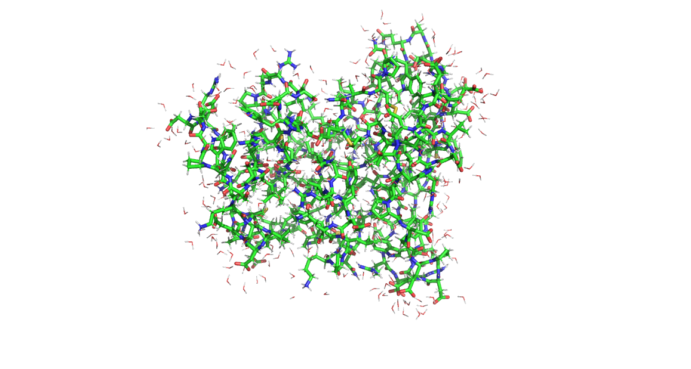
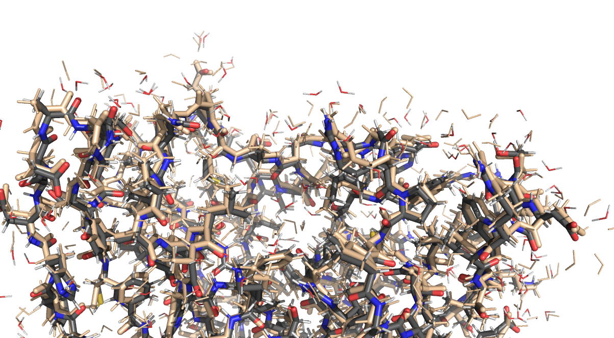

# Running Nequip/Allegro on Frontier

Marc Descoteaux, Seán Kavanagh, Chuck Witt, Chuin Wei Tan, Alby Muselian, Bruno Villasenor Alvarez, David Rogers, July 2025



With the release of allegro 0.5.1 and nequip 0.7.1, the
[MIR-group](https://mir.g.harvard.edu/) has provided
a major update to [Allegro](https://github.com/mir-group/allegro),
including performance tuning for model training on large datasets[^1].
This change also breaks backwards compatibility with previous
versions for `config.yaml`, the model training configuration[^2].

In this HOWTO, we'll walk through steps to run the newer release on
[Frontier](https://docs.olcf.ornl.gov/systems/frontier_user_guide.html).
To focus on end-use first, this article describes the steps in
reverse order.

If you already have access to Frontier, a pre-built environment is available from a user-managed software module that you can use 
by calling:

```
module load ums
module load ums031/allegro
```    


## Running a LAMMPS simulation using a trained model

LAMMPS compiled with the nequip-allegro is able to run simulations
using `pair_style allegro`.
The following job submission script is a standard one for LAMMPS.
This run uses 2 nodes (16 GPU-s) to run dynamics on the DHFR
system (23558 atoms).

```bash
#!/bin/bash
#SBATCH -N 2
#SBATCH -t 00:20:00
#SBATCH -J MD
#SBATCH -A mat281
#SBATCH -o %j.out
#SBATCH -e %j.err

infile=lammps.in

module load ums
module load ums031/allegro

export OMP_NUM_THREADS=1
srun -N $SLURM_JOB_NUM_NODES --ntasks-per-node 8 -c 7 \
    lmp -k on g 8 -sf kk -pk kokkos newton on neigh half -in $infile 
```

The lammps.in file contains
```
variable read_name index dhfr_minimized

boundary p p p
units metal

pair_style allegro
atom_style full
read_data ${read_name}.data

mass 1 1.0078
mass 2 12.011
mass 3 14.0067
mass 4 15.999
mass 5 32.065

pair_coeff      * * Model22_lmax-3_layer-2_tensor-64_AMDtunedkernel.nequip.pt2 H C N O S

timestep 0.0005

#Generate velocities at T = 300 with seed 12345 with rotations, following a gaussian distribution
velocity all create 300.0 401 rot yes dist gaussian
fix 1 all nvt/kk temp 300.0 300.0 0.050

thermo_style custom step temp vol pe press pxx pyy pzz pxy pyz pxz fmax fnorm spcpu cpuremain
thermo 10

# uncomment `fix stop` to run for a fixed amount of walltime
# fix stop all halt 5 tlimit > 180 error continue
run 1000

write_data ${read_name}_out.data
```

Detailed timings for this model have been provided in the article[^1].

Specifically on Frontier, the MD timings we obtained for DHFR using this
workflow are:

| nodes | ns/day |
| ----- | ------ |
|   8   |  0.623 |
|   4   |  0.350 |
|   2   |  0.193 |
|   1   |  0.101 |



## Aside - converting LAMMPS data to pdb

PDB files are most helpful for visualizations.  The included `data2pdb.py`
script was used to make this conversion.  Note that it relies
on the specific molecule numbering peculiar to this input example.
It also does not cover parsing box slants for non-orthogonal boxes
That's because there's no example to work with at the moment.

If you want to re-use it with different atom types, modify the
`ref_masses` variable.

If your water / solvent molecules already have sequential
molecule numbers (i.e. they are not all "2"), you don't need to call
`renumber_waters`.

There's probably better toolkits for molecule file format conversion,
but with LAMMPS people tend to need to do custom things like this.


## Exporting a model for use in LAMMPS

The example above used a pre-trained model (pt2 file) to setup
its `pair_coeff` values.  You can build your own model
from the output of nequip-train by using `nequip-compile`.


The AOTI and custom kernel is compiled using:

    NEQUIP_ALWAYS_COMPILE_FROM_EAGER=0 nequip-compile --mode aotinductor --input-path /path/to/packaged_model.nequip.zip --output-path demo+kernel.nequip.pt2 --device cuda --target pair_allegro

Either a packaged model zip-file or a training checkpoint can be
given to the input-path argument.

Other options exist for compiling these models, including the older
torchscript.  Check the nequip-compile command or docs for more info.
Currently, either pt2 or pth files can be provided to the `pair_coeff`
directive in LAMMPS.


## Packaging a checkpoint

The `nequip-compile` code above can use two different types of input -- a raw model checkpoint, or a "packaged model".  The packaged model is the checkpoint plus source code needed to load it into python.  This makes the packaged model more "stand-alone" and stable against updates to your python environment.

The process for packaging a checkpoint is described in the nequip documentation [^3].

## Training an Allegro Model

To run new trainings or re-train an existing model with new
data, you should use `nequip-train`.
The following SLURM script runs an ML training job in distributed
data parallel mode across 4 nodes.
```bash
#!/bin/bash
#SBATCH -J Train
#SBATCH -p batch
#SBATCH -N 4
#SBATCH -t 0-02:00:00  # runtime in D-HH:MM
#SBATCH -o %j.out
#SBATCH -e %j.err
#SBATCH -A mat281
#SBATCH -C nvme

if [ $# -gt 0 ]; then
	infile=$1
else
	infile=demo
fi

rocm-smi  # optional; get GPU information
#export LD_LIBRARY_PATH="$CRAY_LD_LIBRARY_PATH:$LD_LIBRARY_PATH"
export PL_RECONCILE_PROCESS=1

job_name=$SLURM_JOB_NAME
run_name="SPICE-2_$job_name"

outdir="./outputs/$infile"

export MASTER_PORT=3442
export GLOO_SOCKET_IFNAME=hsn0

# There may be trouble with NCCL sometimes, so this config uses the GLOO backend for DDP
#export NCCL_SOCKET_IFNAME=hsn0
#export NCCL_P2P_DISABLE=1
#export NCCL_IB_DISABLE=1
#export NCCL_NET_GDR_LEVEL=3
#export NCCL_ALGO=Ring
#export NCCL_CROSS_NIC=1

echo $(hostname -i)
export MASTER_ADDR=$(hostname -i)

export WANDB_MODE=offline
export NCCL_DEBUG=WARN

mkdir "/mnt/bb/$USER/triton_cache"
export TRITON_CACHE_DIR="/mnt/bb/$USER/triton_cache/"

mkdir "/mnt/bb/$USER/kernel_cache"
export PYTORCH_KERNEL_CACHE_PATH="/mnt/bb/$USER/kernel_cache/"

echo "NNODES=$SLURM_JOB_NUM_NODES"
echo "NODE LIST=$SLURM_JOB_NODELIST"
echo "NTASKS_PER_NODE=$SLURM_NTASKS_PER_NODE"
echo "CUDA_VISIBLE_DEVICES=$CUDA_VISIBLE_DEVICES"  # should be empty on Frontier as its AMD GPUs
echo "ROCR_VISIBLE_DEVICES=$ROCR_VISIBLE_DEVICES"
echo "MASTER_ADDR=$MASTER_ADDR"
job_ID=(${SLURM_JOBID//./ })

export OMP_NUM_THREADS=1  # faster processing with this
export HYDRA_FULL_ERROR=1  # full Hydra error traceback if any issues
export WORLD_SIZE=$SLURM_NNODES
export PYTHONUNBUFFERED=1 # flush stdout more often

outdir="./outputs/$infile"
echo $infile
echo

if [ -d "$outdir" ];then
  sbcast -pf $outdir/last.ckpt /mnt/bb/$USER/last.ckpt
  srun --ntasks-per-node 8 -c7 nequip-train -cn $infile  -cp "$(pwd)/configs/" hydra.verbose=true hydra.run.dir=$outdir ++num_nodes=$SLURM_JOB_NUM_NODES ++ckpt_path="/mnt/bb/$USER/last.ckpt" | tee -a output_$infile.txt
else
  srun nequip-train -cn $infile  -cp "$(pwd)/configs/" hydra.verbose=true hydra.run.dir=$outdir ++num_nodes=$SLURM_JOB_NUM_NODES | tee output_$infile.txt
fi

wait; exit
```

This script is fairly generic, since all the key configuration
parameters and paths are read from hydra's config.yaml
file -- provided in argument `$1`.  The job can is submitted
via,

    sbatch submit.job demo # will search for configs/demo.yaml

A `configs/demo.yaml` config file is provided below.  It is fairly verbose,
since the `_target_` with `key: value` pairings it uses
specify the classes and initialization parameters used for
all the model, training, logging, and test setup steps.

The [Nequip Training Workflow](https://nequip.readthedocs.io/en/latest/guide/getting-started/workflow.html) contains a more detailed explanation of the steps you should take to properly train (or fine-tune) and test a model.

Note that Allegro is continually being improved, so there are usually
minor upates to how classes are organized and variations to the parameters
used to initialize them.

This results in two issues:

1. [Incompatibility of training checkpoints between nequip/allegro versions](https://nequip.readthedocs.io/en/latest/guide/reference/troubleshoot.html#codebase-changes-break-my-checkpoints). This should be expected between even patchlevel changes.

2. A need to mirror those changes in `config.yaml` files as Allegro is updated. This should be expected for minor version changes.

This HOWTO is tied to the nequip+allegro versions mentioned at the start.
Check the documentation for updates on working with newer releases.

```
# configs/demo.yaml
run: [train,val,test]
num_nodes: 0 # set via command-line
#This is for after training, use single node due to strange validation dataloader error:
#run: [val,test]
#num_nodes: 1

cutoff_radius: 6.0
chemical_symbols: ["B","Br","C","Cl","F","H","I","K","Li","N","Na","O","P","S","Si"] #,Ca,Mg]

model_type_names: ${chemical_symbols}

#Specify Run Name:
logger_name: SPICE-Model22-noearlystop_lmax-2_nscalar-64_ntensor-64_3halfday_v2

#Specify Model Hyperparameters:
model_seed: 1024
model_dtype: float32

#Assumes bessel embedding
model_numbessels: 8
model_bessel_trainable: false
model_polynomial_cutoff_p: 6
model_radial_chemical_embed_dim: 32
model_scalar_embed_mlp_hidden_layers_depth: 2
model_scalar_embed_mlp_hidden_layers_width: 64
model_scalar_embed_mlp_nonlinearity: silu

#Assumes Spline Embedding
#model_num_splines: MODELNUMSPLINESBLANK
#model_spline_span: MODELSPLINESPANBLANK

model_lmax: 2
model_parity: true
model_numlayers: 2

model_num_scalar_features: 64
model_num_tensor_features: 64

model_allegro_mlp_hidden_layers_depth: 2
model_allegro_mlp_hidden_layers_width: 256
model_allegro_mlp_nonlinearity: silu

model_readout_mlp_hidden_layers_depth: 1
model_readout_mlp_hidden_layers_width: 128
model_readout_mlp_nonlinearity: null

#Specify Training Hyperparameters:
batch_size: 8

ema_decay: 0.999

model_tp_path_channel_coupling: true
model_forward_normalize: true

earlystopping_min_delta: 0.000000001
earlystopping_patience: 200

loss_force_weight: 1
loss_energyatom_weight: 1

optimizer_lr: 0.002
optimizer_amsgrad: false

lr_scheduler_factor: 0.8
lr_scheduler_patience: 10
lr_scheduler_threshold: 0.000001
lr_scheduler_minlr: 0.0000001

allow_tf32: false
seed: 901

data:
  _target_: nequip.data.datamodule.NequIPDataModule
  seed: ${seed} #42022024             # dataset seed for reproducibility
  
  train_dataset:
    _target_: nequip.data.dataset.NequIPLMDBDataset
    file_path: /lustre/orion/mat281/proj-shared/24_11_04_BigData/SPICE-2/Revise-TotalEnergy/03_CombineAndLMDB/SPICE-2.0.1-processed_element-types_all_within-6.0_0-totalcharge_use-dfttotalenergy_units-eV-A_train.lmdb 
    transforms:
        # data doesn't usually come with a neighborlist -- this tranforms prepares the neighborlist
      - _target_: nequip.data.transforms.NeighborListTransform
        r_max: ${cutoff_radius}
        # transformation from chemical species names to atom type indices -- to ensure that the data has 0-indexed atom type lists
      - _target_: nequip.data.transforms.ChemicalSpeciesToAtomTypeMapper
        chemical_symbols: ${chemical_symbols}
  val_dataset:
    _target_: nequip.data.dataset.NequIPLMDBDataset
    file_path: /lustre/orion/mat281/proj-shared/24_11_04_BigData/SPICE-2/Revise-TotalEnergy/03_CombineAndLMDB/SPICE-2.0.1-processed_element-types_all_within-6.0_0-totalcharge_use-dfttotalenergy_units-eV-A_val.lmdb 
    transforms:
      - _target_: nequip.data.transforms.NeighborListTransform
        r_max: ${cutoff_radius}
      - _target_: nequip.data.transforms.ChemicalSpeciesToAtomTypeMapper
        chemical_symbols: ${chemical_symbols}
  test_dataset:
    - _target_: nequip.data.dataset.NequIPLMDBDataset
      file_path: /lustre/orion/mat281/proj-shared/24_11_04_BigData/SPICE-2/Revise-TotalEnergy/03_CombineAndLMDB/SPICE-2.0.1-processed_element-types_all_within-6.0_0-totalcharge_use-dfttotalenergy_units-eV-A_test.lmdb 
      transforms:
        - _target_: nequip.data.transforms.NeighborListTransform
          r_max: ${cutoff_radius}
        - _target_: nequip.data.transforms.ChemicalSpeciesToAtomTypeMapper
          chemical_symbols: ${chemical_symbols}
          
  train_dataloader:
    _target_: torch.utils.data.DataLoader
    batch_size: ${batch_size}
    num_workers: 7
    shuffle: true
  val_dataloader:
    _target_: torch.utils.data.DataLoader
    batch_size: ${batch_size}
    num_workers: ${data.train_dataloader.num_workers}
    shuffle: false
  test_dataloader: ${data.val_dataloader}
  
trainer:
  _target_: lightning.Trainer
  max_epochs: 1000
  check_val_every_n_epoch: 1
  log_every_n_steps: 50
  num_nodes: ${num_nodes}
  strategy: 
    _target_: nequip.train.SimpleDDPStrategy
    process_group_backend: gloo
  callbacks:
    - _target_: lightning.pytorch.callbacks.LearningRateMonitor
      logging_interval: epoch
    # to log the loss coefficients
    - _target_: nequip.train.callbacks.LossCoefficientMonitor
      interval: epoch
      frequency: 1
    - _target_: nequip.train.callbacks.TestTimeXYZFileWriter
      out_file: ${hydra:runtime.output_dir}/test
      output_fields_from_original_dataset: [total_energy, forces,subset]
      chemical_symbols: ${chemical_symbols}
    - _target_: lightning.pytorch.callbacks.EarlyStopping
      monitor: val0_epoch/weighted_sum        # validation metric to monitor
      min_delta: ${earlystopping_min_delta}                         # how much to be considered a "change"
      patience: ${earlystopping_patience}                            # how many instances of "no change" before stopping
      verbose: True
    # checkpoint based on some criterion
    - _target_: lightning.pytorch.callbacks.ModelCheckpoint
      monitor: val0_epoch/weighted_sum        # validation metric to monitor
      dirpath: ${hydra:runtime.output_dir}    # use hydra output directory
      filename: best                          # best.ckpt is the checkpoint name
      save_last: true                         # last.ckpt will be saved
    
  logger:
    # Lightning wandb logger https://lightning.ai/docs/pytorch/stable/api/lightning.pytorch.loggers.wandb.html#module-lightning.pytorch.loggers.wandb
    _target_: lightning.pytorch.loggers.wandb.WandbLogger
    project: SPICE-2-demo_Frontier
    name: ${logger_name}
    version: ${logger_name} 
    save_dir: ${hydra:runtime.output_dir}  # use resolver to place wandb logs in hydra's output directory    

training_module:
  _target_: nequip.train.EMALightningModule
  loss:
    _target_: nequip.train.MetricsManager
    metrics:
      - name: force_MSE
        field: forces
        coeff: ${loss_force_weight}
        metric:
          _target_: nequip.train.MeanSquaredError
      - name: peratom_E_MSE
        field:
          _target_: nequip.data.PerAtomModifier
          field: total_energy
        coeff: ${loss_energyatom_weight}
        metric:
          _target_: nequip.train.MeanSquaredError
  val_metrics: 
    _target_: nequip.train.MetricsManager
    type_names: ${model_type_names}
    metrics:
      - name: F_RMSE
        field: forces
        coeff: 1
        metric:
          _target_: nequip.train.RootMeanSquaredError
      - name: peratom_E_RMSE
        field:
          _target_: nequip.data.PerAtomModifier
          field: total_energy
        coeff: 1
        metric:
          _target_: nequip.train.RootMeanSquaredError
      # For monitoring only below:
      # Energy MAE,MSE
      - name: E_MAE
        field: total_energy
        coeff: null
        metric:
          _target_: nequip.train.MeanAbsoluteError
      - name: E_RMSE
        field: total_energy
        coeff: null
        metric:
          _target_: nequip.train.RootMeanSquaredError
      # Force MAE
      - name: F_MAE
        field: forces
        coeff: null
        metric:
          _target_: nequip.train.MeanAbsoluteError
      # Per atom energy MAE
      - name: peratom_E_MAE
        field:
          _target_: nequip.data.PerAtomModifier
          field: total_energy
        coeff: null
        metric:
          _target_: nequip.train.MeanAbsoluteError
      # Per type Force errors:
      - name: F_RMSE_pertype
        field: forces
        coeff: null
        metric:
          _target_: nequip.train.RootMeanSquaredError
        per_type: true
      - name: F_MAE_pertype
        field: forces
        coeff: null
        metric:
          _target_: nequip.train.MeanAbsoluteError
        per_type: true


  test_metrics: ${training_module.val_metrics}

  ema_decay: ${ema_decay}
  optimizer:
    _target_: torch.optim.AdamW
    lr: ${optimizer_lr}
    weight_decay: 0.000001
    amsgrad: ${optimizer_amsgrad}
  lr_scheduler:
    # any torch compatible lr sceduler
    scheduler:
      _target_: torch.optim.lr_scheduler.ReduceLROnPlateau
      factor: ${lr_scheduler_factor}
      patience: ${lr_scheduler_patience}
      threshold: ${lr_scheduler_threshold}
      min_lr: ${lr_scheduler_minlr}
    monitor: val0_epoch/weighted_sum
    interval: epoch
    frequency: 1

  
  model: 
    _target_: allegro.model.AllegroModel
    compile_mode: compile
    # === basic model params ===
    seed: ${model_seed}
    model_dtype: ${model_dtype}
    type_names: ${model_type_names}
    r_max: ${cutoff_radius}


    radial_chemical_embed:
      # classic option is the Bessel scalar embedding module
      _target_: allegro.nn.TwoBodyBesselScalarEmbed
      num_bessels: ${model_numbessels}
      bessel_trainable: ${model_bessel_trainable}
      polynomial_cutoff_p: ${model_polynomial_cutoff_p}
    radial_chemical_embed_dim: ${model_radial_chemical_embed_dim}

    scalar_embed_mlp_hidden_layers_depth: ${model_scalar_embed_mlp_hidden_layers_depth}
    scalar_embed_mlp_hidden_layers_width: ${model_scalar_embed_mlp_hidden_layers_width}
    scalar_embed_mlp_nonlinearity: ${model_scalar_embed_mlp_nonlinearity}

      # one could also use the spline embedding module with less hyperparameters
      #_target_: allegro.nn.TwoBodySplineScalarEmbed
      #num_splines: ${model_num_splines}
      #spline_span: ${model_spline_span}


    # == symmetry ==
    # maximum order l to use in spherical harmonics embedding, 1 is baseline (fast), 2 is more accurate, but slower, 3 highly accurate but slow
    l_max: ${model_lmax}
    # whether to include parity symmetry equivariance
    parity: ${model_parity}   
    tp_path_channel_coupling: ${model_tp_path_channel_coupling}
    forward_normalize: ${model_forward_normalize}

    # == allegro layers ==
    # number of tensor product layers, 1-3 usually best, more is more accurate but slower
    num_layers: ${model_numlayers}
    
    num_scalar_features: ${model_num_scalar_features}
    
    # number of tensor features, more is more accurate but slower, 1, 4, 8, 16, 64, 128 are good options to try depending on data set
    num_tensor_features: ${model_num_tensor_features}

    allegro_mlp_hidden_layers_depth: ${model_allegro_mlp_hidden_layers_depth}
    allegro_mlp_hidden_layers_width: ${model_allegro_mlp_hidden_layers_width}
    allegro_mlp_nonlinearity: ${model_allegro_mlp_nonlinearity}

    # == readout ==
    readout_mlp_hidden_layers_depth: ${model_readout_mlp_hidden_layers_depth}
    readout_mlp_hidden_layers_width: ${model_readout_mlp_hidden_layers_width}
    readout_mlp_nonlinearity: ${model_readout_mlp_nonlinearity}

    # average number of neighbors for edge sum normalization
    avg_num_neighbors: 24.198333704518898 #${training_data_stats:num_neighbors_mean}
    per_type_energy_shifts: [-671.3462690991083,-70045.28385080204,-1030.5671648271828,-12522.649269035726,-2715.318528602957,-13.571964772646918,-8102.524593409054,-16321.459209487615,-198.24187830976174,-1486.3750255780376,-4411.337512366582,-2043.933693071156,-9287.407133426237,-10834.4844708122,-7875.332543264803] #,-18420.82522694509,-5422.381382400712] Energy of neutral isolated atom, OR charge state present in dataset after removing non-neutral frames.
    per_type_energy_scales: [1.2173332450084946, 0.6109583629304155,1.2571483291774914, 0.6602642494436329,0.9071029808279136,0.5945886269274808,1.2006923774046,1.269463026026707, 1.1462756986711797,1.4009897375820222, 1.5253667432829452,1.3012886525276375,2.5027805460674997,1.3631354186130042, 1.1990232381708512] #${training_data_stats:per_type_forces_rms}
    per_type_energy_scales_trainable: false
    per_type_energy_shifts_trainable: false

    # == ZBL pair potential ==
    pair_potential:
      _target_: nequip.nn.pair_potential.ZBL
      units: metal     # Ang and kcal/mol, LAMMPS unit names;  allowed values "metal" and "real"
      chemical_species: ${chemical_symbols}   # must tell ZBL the chemical species of the various model atom types

# global options
global_options:
  allow_tf32: ${allow_tf32}
```

The above config represents mostly best practices for a specific production training
run on a specific large dataset.  It represents a fairly heavily customized
config that is much more complicated than the [tutorial config](https://github.com/mir-group/allegro/blob/main/configs/tutorial.yaml) needed to get started.
It is still short, however, on test datasets.  Obviously, as you gain confidence in
your models, you will want to add more of your own test datasets.

Full details and descriptions of the various configuration file options
are provided in the [nequip docs](https://nequip.readthedocs.io/en/latest/guide/guide.html).  Specific options related to allegro.model.AllegroModel are documented
within [the allegro docs](https://nequip.readthedocs.io/projects/allegro/en/latest/guide/allegro_model.html).


## Re-building the environment

The [libenv](https://gitlab.com/frobnitzem/libenv/) tool automates
the process of re-building an environment, where a set of packages
are all installed to a single `$prefix` directory.

You can re-build your own environment by installing and configuring
libenv, then running `libenv install allegro.yaml` with
the following allegro.yaml.

On Frontier, libenv is available pre-installed as a module:

    module load ums
    module load ums031/libenv

```yaml
# allegro.yaml
environment:
  - type: Module
    specs:
      - PrgEnv-amd
      - craype-accel-amd-gfx90a
      - amd/6.2.4
      - cray-mpich/8.1.30
      - rocm/6.2.4
  - type: Var
    vars:
      MPICH_GPU_SUPPORT_ENABLED: "1"

  - type: Venv
    python: /opt/cray/pe/python/3.11.7/bin/python
    system_site_packages: True
    specs:
      - numpy
      - scipy
      - matplotlib

  - type: Venv
    opts: 
     - "--index-url=https://download.pytorch.org/whl/rocm6.2.4"
    specs:
     - torch
     - torchvision
     - torchaudio

  - type: Var
    prepend:
      CMAKE_PREFIX_PATH: $prefix/lib/python3.11/site-packages/torch
      LD_LIBRARY_PATH: $prefix/lib/python3.11/site-packages/torch/lib

  - type: Venv
    specs:
      - wandb
      - git+https://github.com/mir-group/nequip@v0.7.1
      - git+https://github.com/mir-group/allegro@v0.5.1
      - git+https://github.com/e3nn/e3nn.git

  - type: Cmake
    artifacts:
      - git+https://github.com/lammps/lammps.git@stable
      - git+https://github.com/mir-group/pair_nequip_allegro.git
    source: lammps.git@stable/cmake
    pre_configure: "cd ../../pair_nequip_allegro.git && ./patch_lammps.sh ../lammps.git@stable"
    cmake:
      PKG_KOKKOS: "ON"
      Kokkos_ENABLE_HIP: "ON"
      MPI_CXX_COMPILER: "$ROCM_PATH/bin/hipcc"
      CMAKE_CXX_COMPILER: "$ROCM_PATH/bin/hipcc"
      Kokkos_ENABLE_HIP_MULTIPLE_KERNEL_INSTANTIATIONS: "ON"
      CMAKE_HIPFLAGS: "--offload-arch=gfx90a"
      CMAKE_CXX_FLAGS: "-fdenormal-fp-math=ieee -fgpu-flush-denormals-to-zero -munsafe-fp-atomics -I$MPICH_DIR/include"
      CMAKE_EXE_LINKER_FLAGS: "-L$MPICH_DIR/lib -lmpi $CRAY_XPMEM_POST_LINK_OPTS -lxpmem $PE_MPICH_GTL_DIR_amd_gfx90a $PE_MPICH_GTL_LIBS_amd_gfx90a"
      MKL_INCLUDE_DIR: "$prefix/include" # not really there
      USE_MKLDNN: "OFF"
      NEQUIP_AOT_COMPILE: "ON"
      PKG_MOLECULE: "ON"

  - type: Var
    vars:
      CUDA_HOME: $ROCM_PATH
      TORCHINDUCTOR_MAX_AUTOTUNE: "1"
      TORCHINDUCTOR_LAYOUT_OPTIMIZATION: "1"
      PYTORCH_MIOPEN_SUGGEST_NHWC: "1"
      TORCHINDUCTOR_CPP_WRAPPER: "1"
      TORCHINDUCTOR_FREEZING: "1"
```

### Directly Building LAMMPS+Allegro

If you prefer to skip libenv, you can use the following instructions
to build LAMMPS+Allegro directly.  This also uses the HIP backend
for Kokkos.

```bash
#!/bin/bash
LAMMPS_ALLEGRO_ROOT=${HOME}/lammps_allegro

# Set the environment
module load PrgEnv-gnu
module load cray-mpich
module load craype-accel-amd-gfx90a
module load rocm/6.4.1
module load cmake

#Set directories
LAMMPS_ROOT=$LAMMPS_ALLEGRO_ROOT/lammps
PAIR_ALLEGRO_ROOT=$LAMMPS_ALLEGRO_ROOT/pair_nequip_allegro
cd $LAMMPS_ALLEGRO_ROOT

# Download the torch C++ library (for ROCm 6.4)
LIBTORCH_URL=https://download.pytorch.org/libtorch/rocm6.4/libtorch-shared-with-deps-2.8.0%2Brocm6.4.zip
if [ ! -d "libtorch" ]; then
  wget ${LIBTORCH_URL}
  unzip libtorch-*
  rm -r libtorch-*
fi

# Get LAMMPS and pair_allegro
if [ ! -d "${LAMMPS_ROOT}" ]; then
  git clone --depth=1 https://github.com/lammps/lammps $LAMMPS_ROOT
fi
if [ ! -d "${PAIR_ALLEGRO_ROOT}" ]; then
  git clone --depth=1 https://github.com/mir-group/pair_nequip_allegro $PAIR_ALLEGRO_ROOT
  # Patch LAMMPS
  cd ${PAIR_ALLEGRO_ROOT}; ./patch_lammps.sh ${LAMMPS_ROOT}
fi

# Build LAMMPS
mkdir ${LAMMPS_ROOT}/build; cd ${LAMMPS_ROOT}/build
MPICXX=$(which CC)
CXX=${ROCM_PATH}/bin/hipcc
TORCH_PATH="${LAMMPS_ALLEGRO_ROOT}/libtorch"
cmake -DBUILD_MPI=on \
      -DPKG_KOKKOS=ON \
      -DKokkos_ENABLE_HIP=on \
      -DMPI_CXX_COMPILER=${MPICXX} \
      -DCMAKE_CXX_COMPILER=${CXX} \
      -DKokkos_ENABLE_HIP_MULTIPLE_KERNEL_INSTANTIATIONS=ON \
      -DCMAKE_HIPFLAGS="--offload-arch=${GPU_ARCH}" \
      -DCMAKE_CXX_FLAGS="-fdenormal-fp-math=ieee -fgpu-flush-denormals-to-zero -munsafe-fp-atomics -I$MPICH_DIR/include" \
      -DMKL_INCLUDE_DIR="/tmp" \
      -DUSE_MKLDNN=OFF \
      -DNEQUIP_AOT_COMPILE=ON \
      -DPKG_MOLECULE=ON \
      -DCMAKE_PREFIX_PATH="${TORCH_PATH}" \
      ../cmake
make -j 16 install
```


* [^1]: High-performance training and inference for deep equivariant interatomic potentials <https://arxiv.org/pdf/2504.16068>
* [^2]: Upgrading from pre-0.7.0 Nequip <https://nequip.readthedocs.io/en/latest/guide/reference/faq.html#upgrading-from-pre-0-7-0-nequip>
* [^3]: Packaging an NequIP model <https://nequip.readthedocs.io/en/latest/guide/getting-started/workflow.html#packaging>
